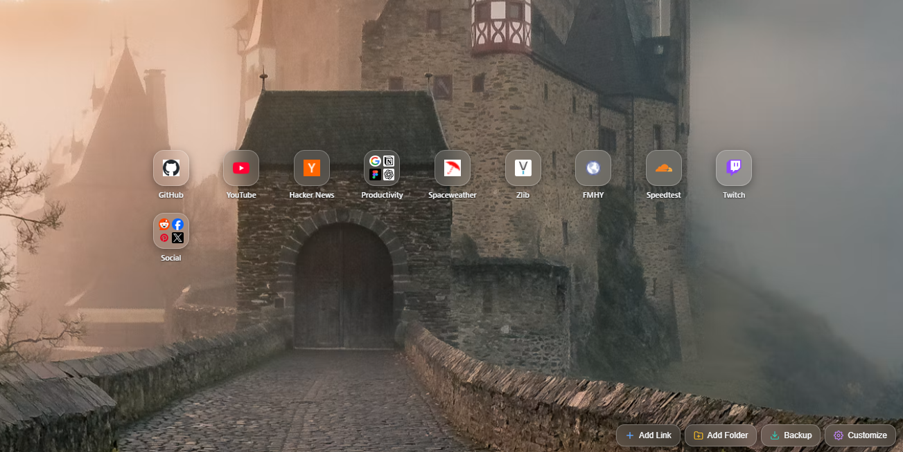

## ⚒️New Tab Page chrome extension 

- glassy icons
- folders
- local backup
- wallpaper (use an optimised image)

 ---
 
**DISCLAIMER : This is a vibe coded project for personal use**

*Creating link from inside a folder is currently bugged, create link outside then add to folder*

---

---
# Extension Installation Guide

Instructions to add this extension to Chromium-based browsers

## 1. Google Chrome

1. Open Chrome and navigate to `chrome://extensions`.
2. Turn on the **Developer mode** toggle in the top-right corner.
3. Click the **Load unpacked** button in the top-left toolbar.
4. Select the folder containing the extension files (the folder containing `manifest.json`).

## 2. Microsoft Edge

1. Open Edge and navigate to `edge://extensions`.
2. Turn on the **Developer mode** toggle in the left sidebar menu.
3. Click the **Load unpacked** button.
4. Select the folder containing the extension files (the folder containing `manifest.json`).

## 3. Brave Browser

1. Open Brave and navigate to `brave://extensions`.
2. Turn on the **Developer mode** toggle in the top-right corner.
3. Click the **Load unpacked** button in the top-left toolbar.
4. Select the folder containing the extension files (the folder containing `manifest.json`).

---

## Updating the Extension

When you make changes to the source code:
1. Return to the extensions page (`chrome://extensions`, `edge://extensions`, or `brave://extensions`).
2. Find this extension in the list.
3. Click the **Reload (circular arrow)** icon on the extension card.
